# Introduction 

## 1. Objects, lights, camera and render!

### Step A 

+ In this step we import the OBJ files: File > import > wavefront (.obj)
+ Once the models are imported, we can move, rotate and scale them to create a visually appealing scene

--> With Key "G" we move the objects next to each other. We can constrain the movement to a specific axis by pressing **"X", "Y" or "Z"**

--> with key "R" we rotate the selected object. We can also rotate around a specific axis by pressing **"X", "Y" or "Z"**

--> with key "S" we can scale a selected object. Also to scale along a specific axis, we press **"X", "Y" or "Z"**

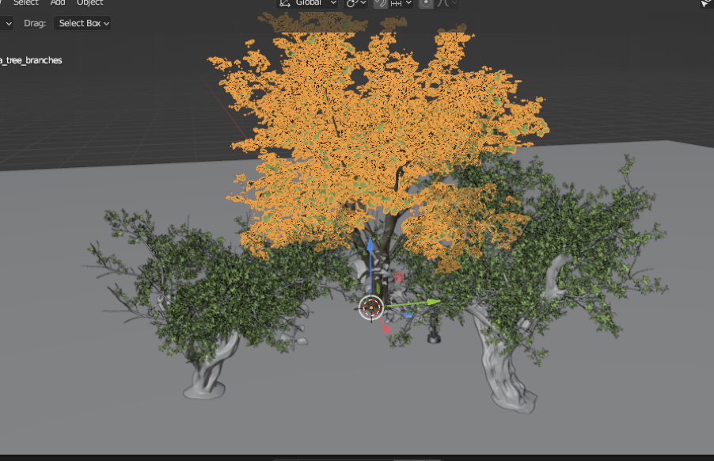

### Step B 

Shader Editor allows us to create and edit complex material and lightning setups. Therefore we use the enviroment texture node 

+ To import the node, we press in shader editor "A" to bring up the "Add" menu and finally add **"enviroment texture"** 

+ We connect the color output of the enviroment texture node to the color input of the backgroundnode. 

+ For rotating the **HDRI**, we use "mapping nodes" and "texture coordiante nodes". 

We can finally rotate the HDRI by chaning the "Rotataion" values in the mapping node. 

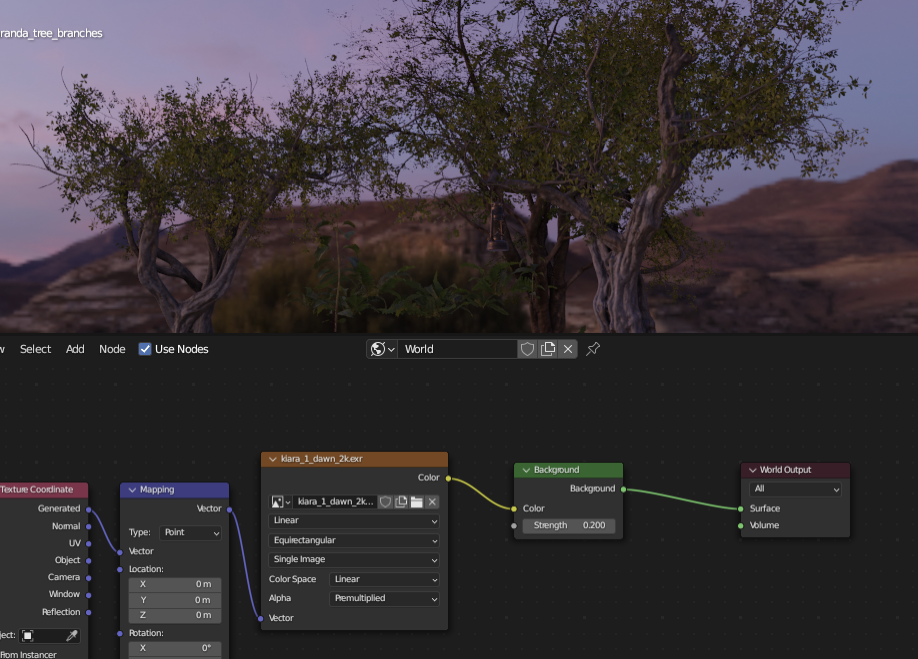

### Step C

In the Shader Editor we can create and edit materials for our project using the node-based system. We create a new material with emissive properties for the object. 

+ After selecting the right object, we click on the "object tab", so that we can edit object's material. 
+ To add emission to the material, we click on the small circle next to the emission socket and choose color in dropdown menu 
+ with "emission strength" we can control the intesitiy of the emitted light 

By creating material with emissive properties (using principled BSDF), we can add glowing objects easily. 

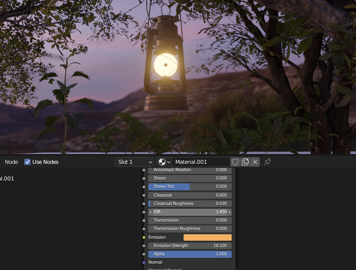

### Step D 

We now want to add and position a camera in our blender scene 

+ by pressing "shit + A" the "add" menu pops up. We can press "camera" to add a camera to our scene 
+ Again, by pressing "G" we can move the camera. It will be places at the 3D cursor location 
+ Again, by pressing "R" we can rotoate the camera. Again, rotating around a specific axis: **"X", "Y" or "Z"**
+ We can adjust the camera position while looking through it by pressing "Numpad0" and "G" 

By adding and positioning the camera in our scene, we can clearly define the viewpoint from which the final image will be rendered. 

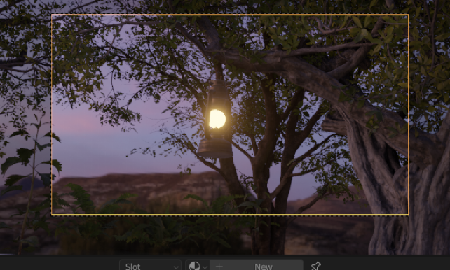

## Step E 

Adding lights to our scene is crucial for illuminating our 3D objects and creating the visually appealing render. 

+ with "shift + A" we navigate to "light" > "Area". We add an area light to our scene. 
+ again by pressing "R" and "G" we can move and rotate the Area 
+ wihin the option "object data properties" we cann edit color and intesity 

We added now an Area light and we customized its color and intesity. This step greatly enhanced the overall appearence of our 3D renders. 

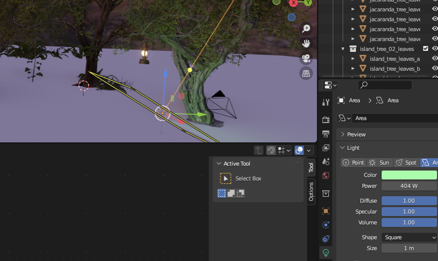

### Step F 

We can press F12 to render and select "compostitng" tab to edit our **final result**

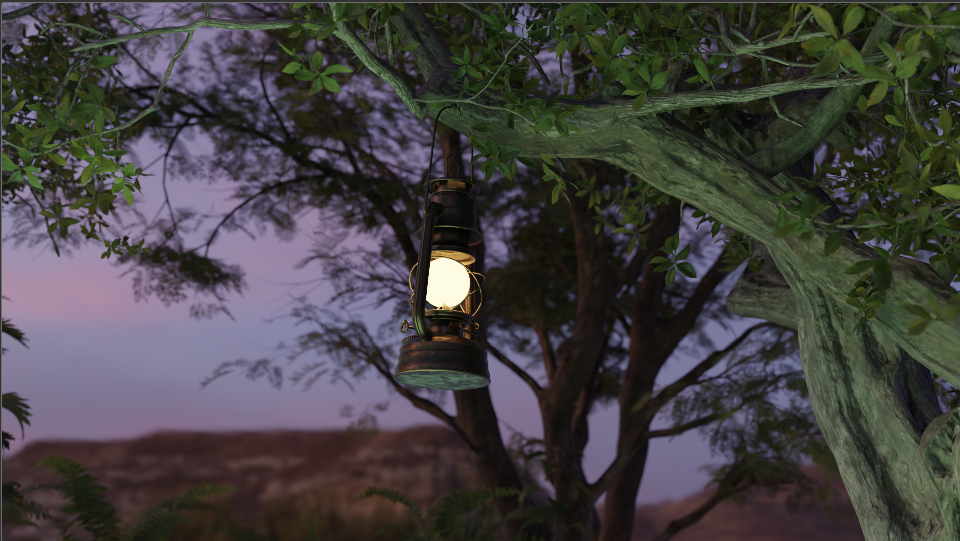

### Step G 

By using nodes in the Compositor, we cann apply various post-processing effects like glare to enhance the final render. We use the "viewer" node to preview the image with a background and apply the Glare node. 

+ we connect the image output of the render layers node to the image input of the viewer node. Now the rendered image will appear as the background in the Compositor 

+ We apply the Glare effect by pressing spacebar and insert the Glare node 

We used nodes and applying glare effect to enhance our rendered image

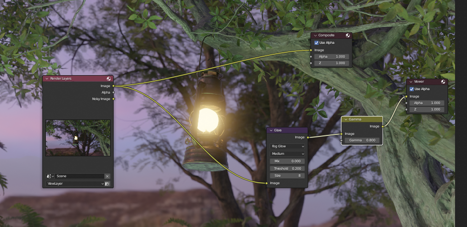

Now we press "shif + A", then filter and select "posterize" node. (lower steps uses less colors)

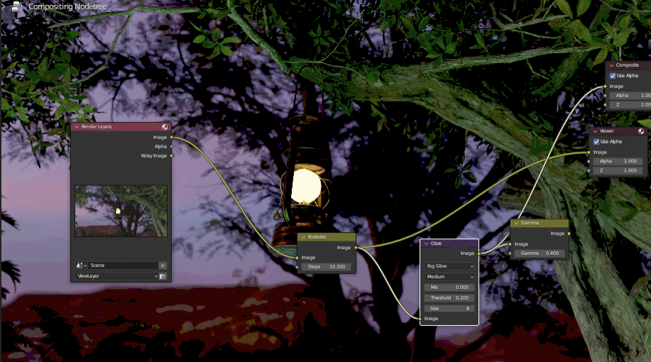

### Step H 

We now create pixelated effects in the compostitor using "scale- " and "pixelated nodes" 

+ after adding nodes, we connect image output of the render layers node to the image input of the first scale node 
+ By chaning X and Y in the first scale node, we shrink the image by factor of 5 
+ after adding pixelate node, we connect the image output of the first scale node to the image input of pixelate node 
+ finally we change x and y in the second scale node to values 12. This will enlarge the image by factor 12 --> giving it the pixelated effect 

We used the scale and pixelated nodes to create a pixelated effect on our rendered image. 

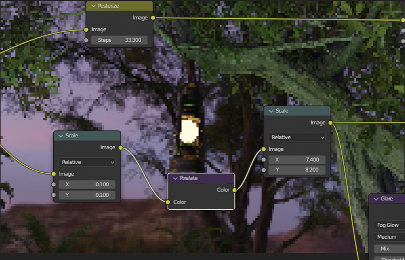

## 2. Editing objects: materials

### Step A 

We choose and import a 3D model from any of the given libraries. 

This object will be used to test different textures. 

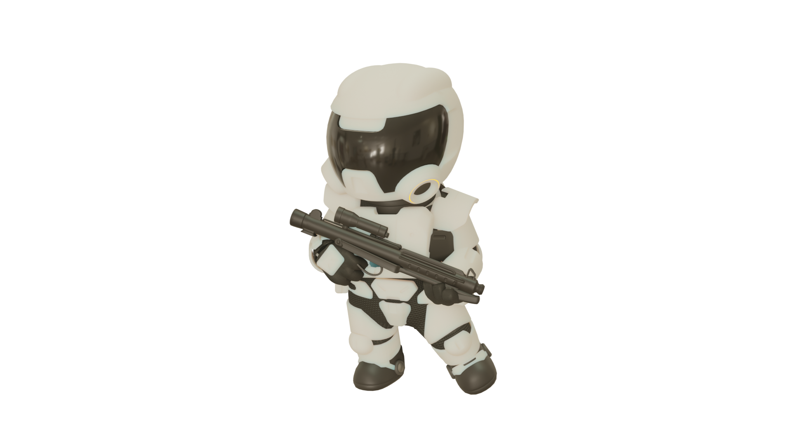

### Step B 

We will now apply a subsurface scattering (SSS) texture to our 3D model. 

+ we check if model if model has already material assigned to it. If not, we create new material 
+ with the picipled BSDF shader node selceted, we create a subsurface scattering node 
+ in the SS node setting we need to click on color picker to choose a color 

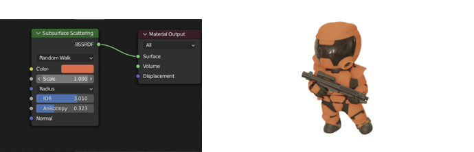

### Step C 

We now want to apply multiple texutres to our 3D model 

+ in the shader editor we import all of our needed textures 
+ we can adjust the mapping and UV coordinates for each texture. Therefore we connect uv output of the texture coordinate noed to the vector input of the mapping node
+ after connecting everting correctly, we now connect the textures to the corresponign inputs of the prinicpled BSDF node

We connect the bump texutre to color and then with normal. We intert a displacement node and connect the displacement map to the height. 

After that we need to connect it to the displacement item in the corresponding material output

Finally, we created a more realistic material for our 3d models by connecting all textures to the principled BSDF shader. 

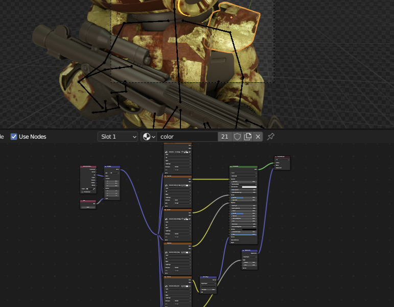

### Step D

We now want to unwrap our 3D model and create UV seams 

+ after switching to edge select mode, we can select the edges where we want the seams to be 

+ after marking the seams we can choose unwrap. Blender will now create a UV map for out 3D model using the marked seams to define the boundaries of the UV islands 

+  after switching to the face select mode we can select all faces in the §D viweport that are displayed in the UV editor 

We now controlled the textures that are mapped onto our models by unwrapping the 3D models and creating UV seams 

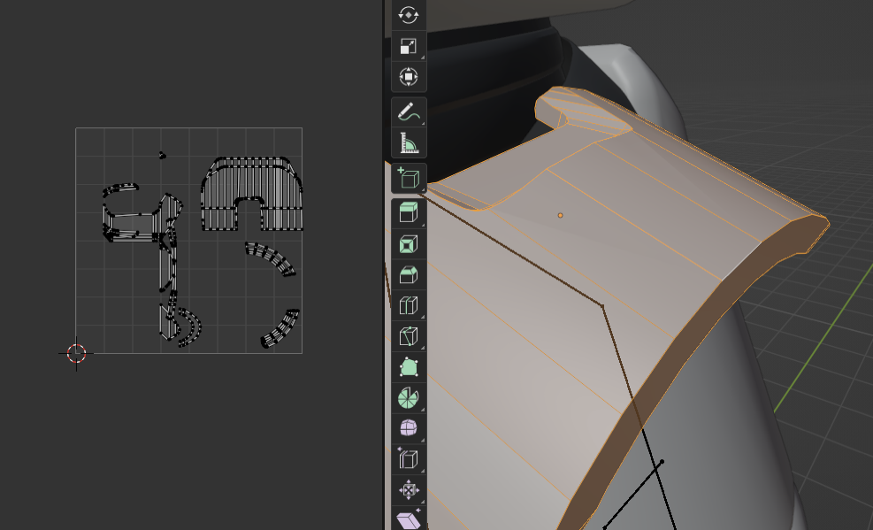

Our endered image looks like: 

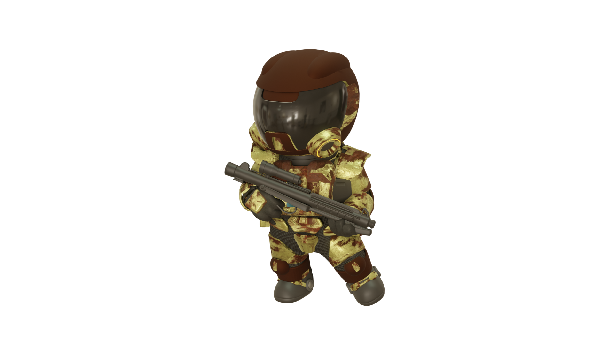

### Step E 

We want to create a metallic procedural texture with shine and dirty areas using the musgrave texture

+ we need to create a musgrave texture node. We can achive the desired level of detail by adjusting "scale" value in the node 

+ after that, we add a converter colorRamp node. We connect the color output of this node to the base color input of the principled BSDF node. So we define the colors of the metallic texture 

+ we change the material to metallic by chaning the "metallic" value in the pricipled BSDF node to 1. We achive a semi-metallic look by change value to 0-1. 

Now our 3D model hhas a metallic procedural texture apllied (shiny dirty areas definded by musgrave texture)

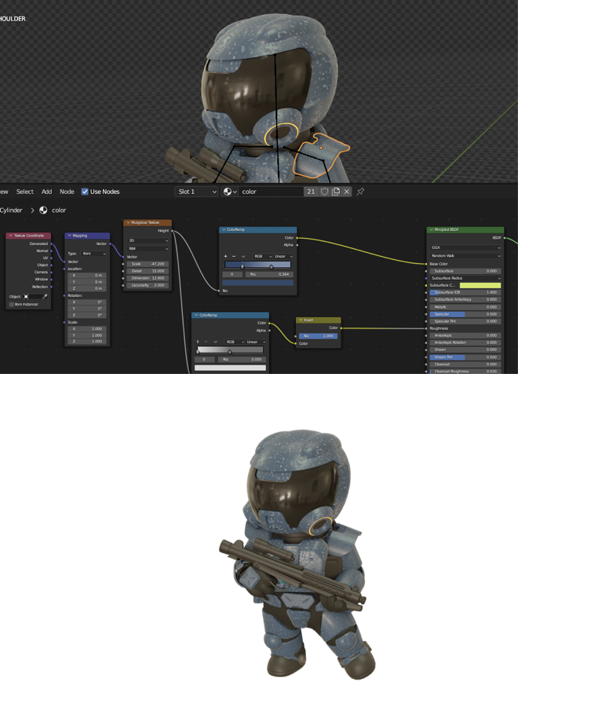

## 3. Modeling objects

### Step A 

We now want to model a simple object with a beveled edge using a cube 

+ We add a cube and use S to scale it along the z axis --> create base mesh 

+ We can use tab to enter edit mode and extured the top faces 

+ adter adding a bevel modifier to our object, we can set the segemnts value to 3. This will create three segements for reach beveled edge. 

+ we can also adjust width or profile tho change the appearance of the beveled as needed

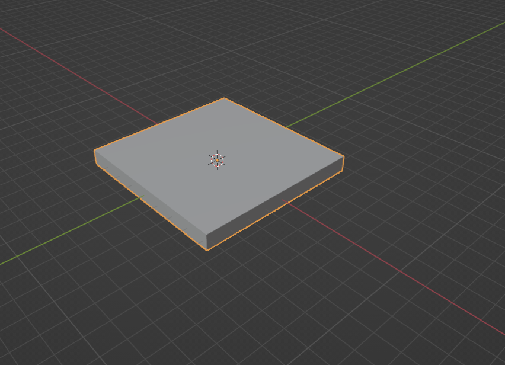

### Step B 

We now want to create a cratar using a cube. 

+ after adding a cube, we press ctrl 2 to add a subdivision surface modifier with two levels of subdivision. This will make the cube appear rounder and smoother 
+ we finally mesh, scale an extrude to create raised rim and inner walls of our cratar 

We now created a simple crater model from a cube. 

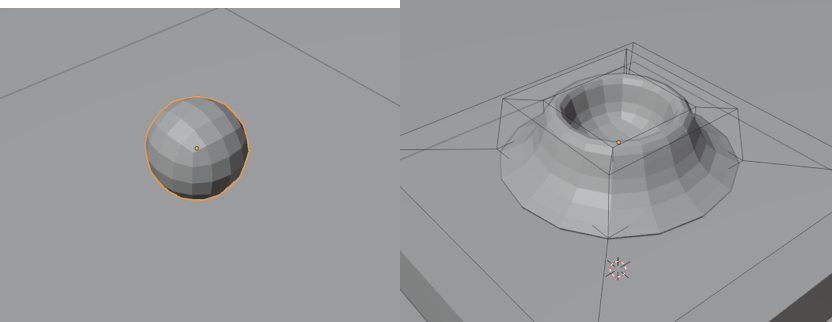

### Step C 

We now want to adjust the vertices of our cratar model to create more irregular shapes

+ switch to vertex select mode, 2 for edges, 3 for faces 
+ multiply vertices
+ we continue selecting and adjusting vertecies to create more irregular and more natural looking shapes 

We adjusted the posistion of the vertices. Now we can create more irregular and more natural-looking shapes

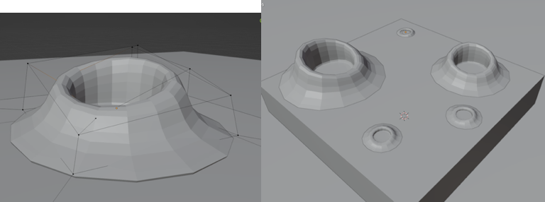

We now add a cylinder an set of 6 vertices. This will be the basic shape for our lonar module 

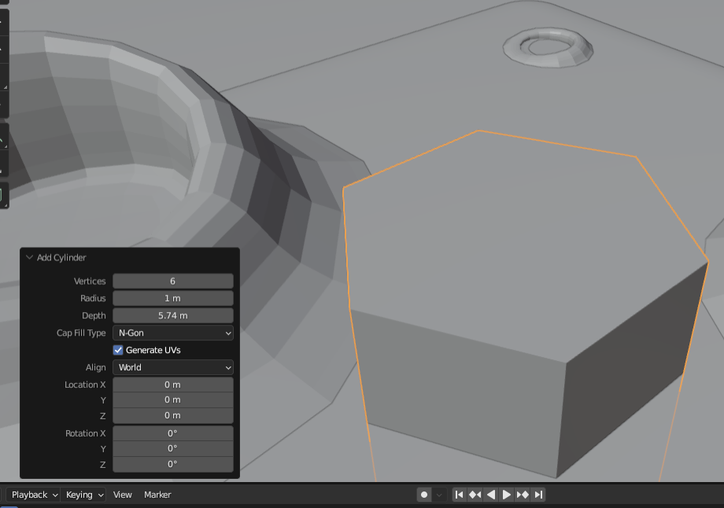

We now add an ico-sphere. This will be the cabin 

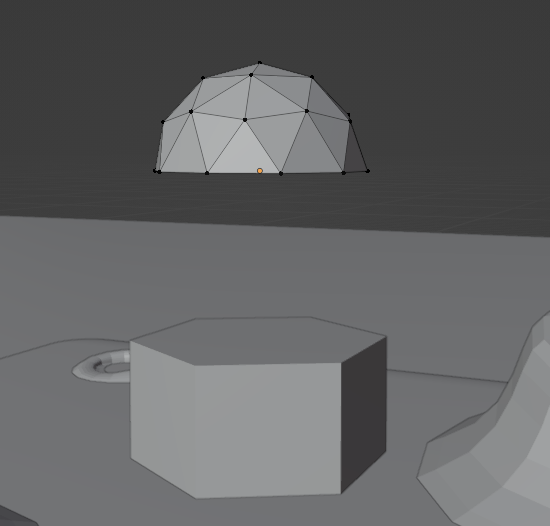

After that, we will add a cube, apply a subdivision multipliere and extrude it to make the supports. 

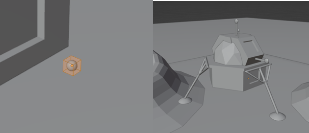

### Step D

Finally, we apply all materials to the corresponding objects 

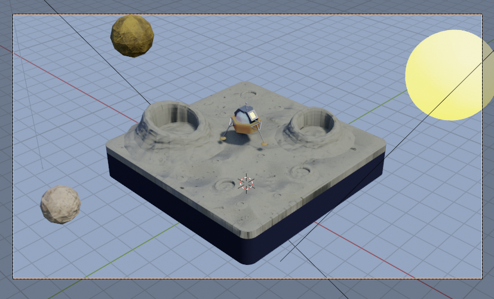

## 4. Animation basics

### Step A 

We now want to create a basic animation of a rotating plant 

+ therefore we open the timeline editor and make sure current frame is set to 1 

+ We display the objects transform properties and set the rotation value for the desired axis (X, Y, Z) to 0. For example, we set the Z rotation to 0 to rotate the planet around the Z-axis 

+ at latest we select the last frame and set the roation to value 2000 and save the keyframe 

The planet will now rotate. 

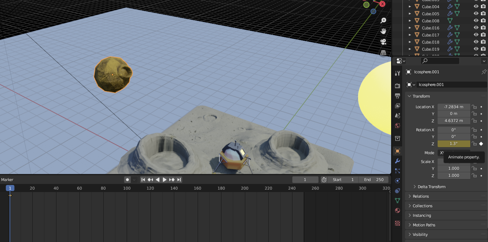

After that, we select the first frame and select the sun. We move it to the first position and press I to save a location keyframe. 

### Step B 

We now want to create a simple animation of the spaceship landing. 

+ We now display the objects transform properties and set the inital postion of the spaceship
+ We save a location keyframe 
+ We now move it near the ground and safe another keyframe 
+ With ctrl d we move it steps forward 
+ we will use the keyframe to make the ship stop before landing
+ we can optionally add more rotation keyframes to create more dynamic animation

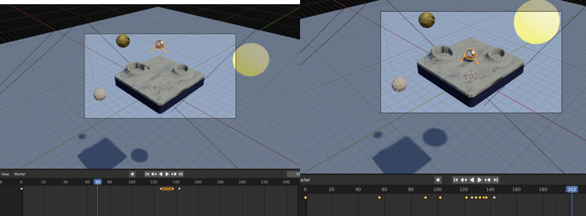

### Step C 

We want to create a path for objects to follow by using a bezier curve. 

+ in 3D viewport, we can press shif a to add the bezier curve
+ we can now select and move the control points and the handles 
+ We can extrude and create more control points if needed. A new point is connected to the previous one

Once we created the path, we can male an object follow it by using a follow path constraint 

+ we set target field to bezier curve 

The object will now follow the path we created using the bezier curve. 

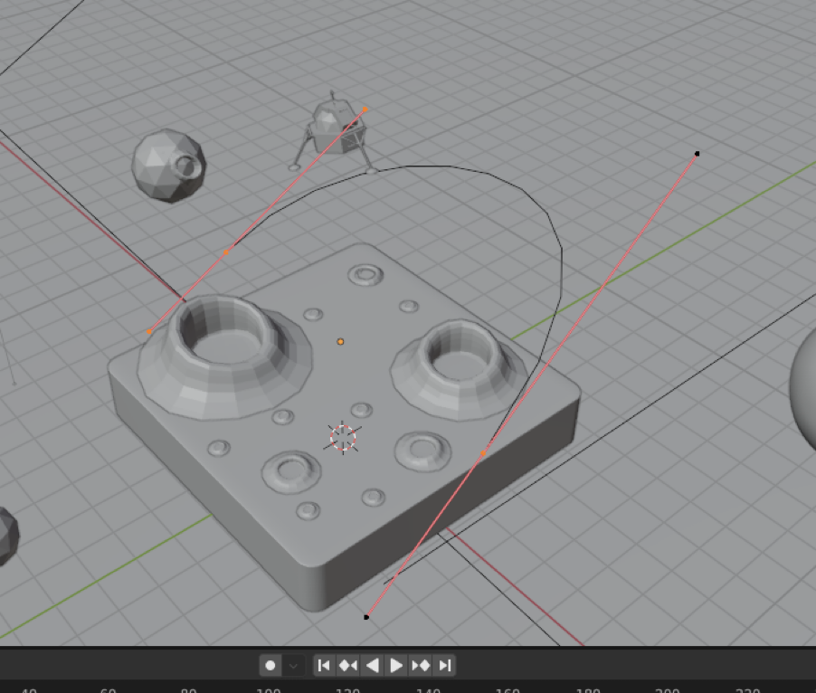

We now select the object and press "follow path" in the object constraint properties 

We use the bezier curve as the source, then use the factor values as a keyframe to animate the object 

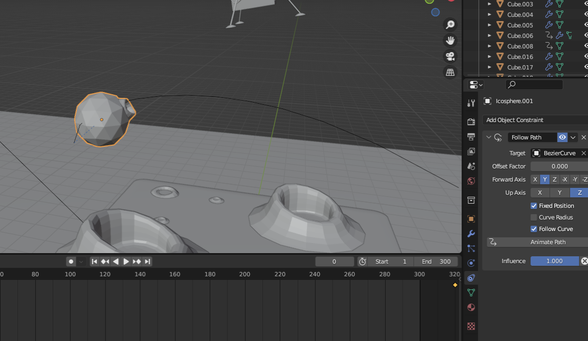

Finally, we use a particle system to set various elements along a surface. 

We can move the objects to the origin and afterwards move them to the same collection. 

Finally after selecting hair in newly created one, we set render as collection. 

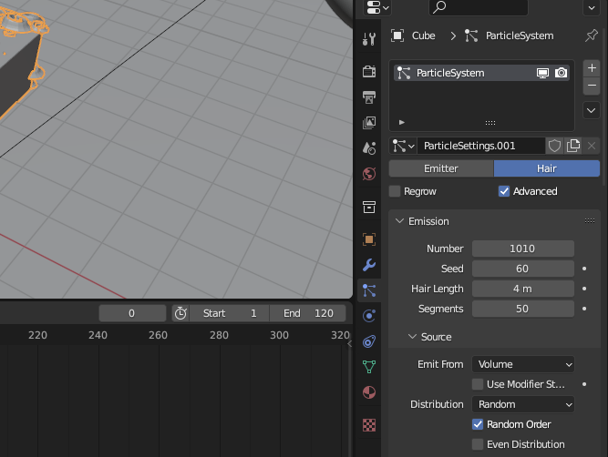

## 10. Geometry nodes

Here are the following steps we perform: 

+ We create a new file 

+ We need to downlaod necessary assets (polyhaven.com)

+ We append assets into the file and place them into seperate collection 

+ We create a plane for terrain, add a new material to it and add all the textures into necessary slots (Base Color, Roughness, Normal and Displacement) add Texture coordinates and Mapping nodes to be able to scale the texture.

+ We add Geometry node modifier and set up a node system on the terrain object. We can distribute Points on Faces to get random places to distribute the objects, Instance on Point to place the scatter objects on terrain object. Collection Info Node is used to grab objects from a collection and distribute them on terrain. Join geometry Node to show both, the original terrain object and scattered objects at the same time. Random Value Node in rotation to rotate scattered objects randomly.

+ Camera Setup, Placed a camera by moving it around and turned on Depth of field and set Focus object to a Gnome object.

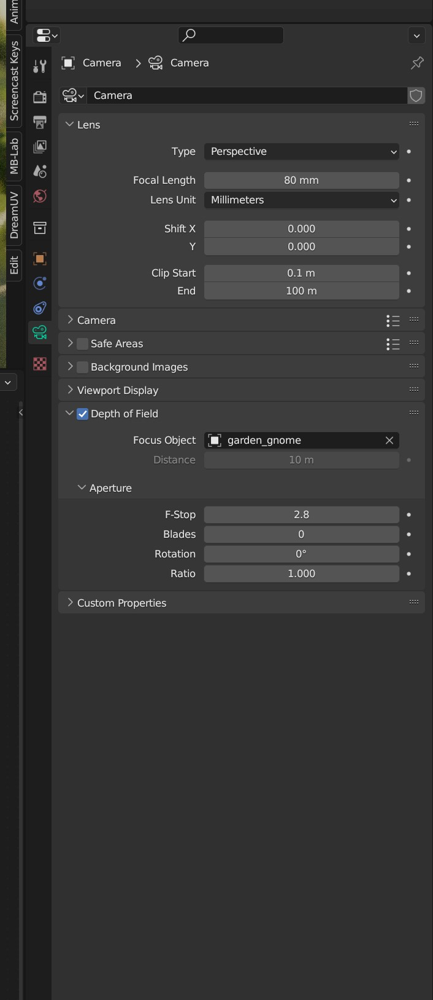

+ Render settings: We switch Render Engine to Cycles Experimental (to support material displacement)

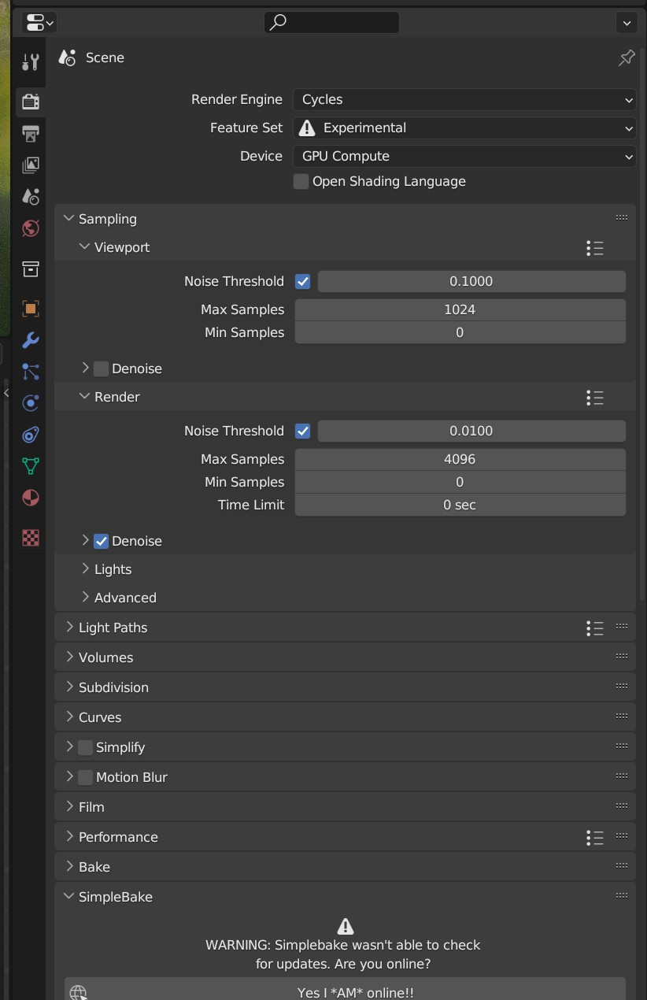

Finally, we set up lighting by adding Sky Texture to World in World Setting and adjusting the texture settings to get near sunset light.

